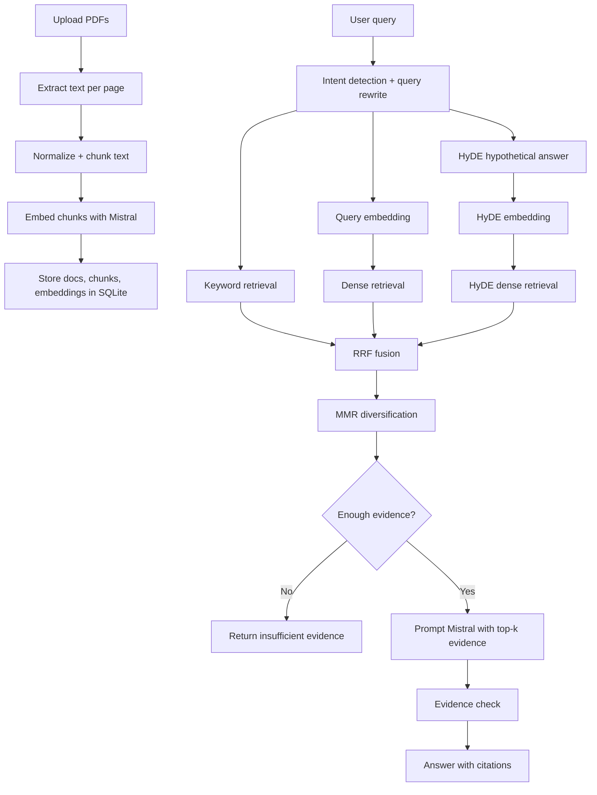

# PDF RAG with FastAPI and Mistral

A Retrieval-Augmented Generation system for PDF knowledge bases built with FastAPI and Mistral. The implementation avoids external RAG/search frameworks and third-party vector databases; chunking, retrieval, fusion, reranking, and evidence gating are implemented directly in Python.

## What This Submission Covers

- `POST /ingest` to upload one or more PDFs
- `POST /query` to ask grounded questions over the indexed corpus
- `POST /reset` to clear the local index
- a browser UI for upload, querying, history, and citation review
- Mistral embeddings + generation
- citations, refusal behavior, insufficient-evidence fallback, and a post-hoc hallucination check

## Libraries Used

- [FastAPI](https://fastapi.tiangolo.com/)
- [Mistral AI API](https://docs.mistral.ai/api/)
- [PyPDF](https://pypdf.readthedocs.io/en/stable/)
- [NumPy](https://numpy.org/)
- SQLite from the Python standard library

## Architecture



## Techniques Used and Why

### Chunking

- Sentence-aware chunking with overlap
- Page-aware metadata for source citations
- Section-title extraction for chunk metadata
- Whitespace normalization before chunking
- Reference-page filtering for academic PDFs

Why:
- sentence boundaries preserve meaning better than raw fixed windows
- overlap reduces boundary loss
- page tracking makes citations explicit
- section metadata helps section-specific ranking
- references pages often degrade retrieval quality and should not dominate results

### Query processing

- intent detection to avoid unnecessary retrieval for greetings
- lightweight typo normalization for common technical misspellings
- query rewriting with compact keyword extraction

Why:
- reduces wasted retrieval calls
- improves recall for narrow technical questions
- supports both dense and keyword retrieval paths

### Retrieval

The system combines three retrieval signals:

1. dense retrieval from the rewritten query embedding
2. BM25-style keyword retrieval implemented directly in Python
3. HyDE-style dense retrieval using a hypothetical answer passage

Why:
- dense retrieval handles paraphrases
- keyword retrieval is better for exact terms, formulas, acronyms, and section names
- HyDE improves recall when the question is underspecified or phrased differently from the source text

The HyDE idea is inspired by Gao et al. (ACL 2023): [paper](https://aclanthology.org/2023.acl-long.99/).

### Fusion and reranking

- Reciprocal Rank Fusion (RRF) across dense, keyword, and HyDE rankings
- additional exact-term, phrase, and heading boosts
- section-title boost when chunk metadata aligns with the query
- Maximal Marginal Relevance (MMR) to diversify the final top-k evidence

Why:
- RRF is robust when multiple retrieval methods are useful in different cases
- exact-term and heading boosts help with technical PDF QA
- MMR reduces repeated or near-duplicate chunks in the evidence set

RRF is based on Cormack, Clarke, and Büttcher (SIGIR 2009): [paper metadata](https://ir.webis.de/anthology/2009.sigirconf_conference-2009.146/).

MMR is based on Carbonell and Goldstein (SIGIR 1998): [paper metadata](https://sigmod.org/publications/dblp/db/conf/sigir/CarbonellG98.html).

### Evidence extraction

- retrieval operates on chunks
- citations are distilled to the most query-relevant sentences inside each selected chunk

Why:
- chunk retrieval is more stable than pure sentence-level indexing in a small system
- sentence-level evidence is clearer for citation review and grounded QA

### Generation and grounding

- prompt requires answers to stay within provided evidence
- citations are required for material claims
- if the top evidence score is too weak, the system returns `insufficient evidence`
- a lightweight evidence check scans for unsupported answer sentences

Why:
- the assignment rewards grounded behavior, not unconstrained generation
- refusal on weak evidence is better than fabricating an answer

## API

### `POST /ingest`

Accepts one or more PDFs via multipart form-data.

```bash
curl -X POST http://127.0.0.1:8000/ingest \
  -F "files=@/path/to/file1.pdf" \
  -F "files=@/path/to/file2.pdf"
```

### `POST /query`

Accepts a JSON query.

```bash
curl -X POST http://127.0.0.1:8000/query \
  -H "Content-Type: application/json" \
  -d '{"query":"How does self-attention differ from recurrent models?","top_k":6}'
```

### `POST /reset`

Clears the indexed documents and chunks.

```bash
curl -X POST http://127.0.0.1:8000/reset
```

## Running Locally

```bash
python3 -m venv .venv
source .venv/bin/activate
pip install -r requirements.txt
export MISTRAL_API_KEY="YOUR_KEY"
uvicorn app.main:app --reload
```

Open [http://127.0.0.1:8000](http://127.0.0.1:8000).

During development, the provided assignment key returned `401 Unauthorized`, so a personal Mistral key was required. The application supports any valid key through `MISTRAL_API_KEY`.

Useful overrides:

```bash
export RAG_HYDE_ENABLED=true
export RAG_TOP_K=8
export RAG_MIN_EVIDENCE_SCORE=0.18
export RAG_EMBED_BATCH_SIZE=2
```

## Security and Failure Handling

- API keys are read from environment variables only
- uploaded files stay local to the application workspace
- the UI escapes model output before rendering
- PII, legal-advice, and medical-advice requests are refused
- weak evidence returns `insufficient evidence`
- Mistral `400`, `401`, and `429` errors are surfaced clearly for debugging

## Evaluation Examples

These questions were used as targeted checks for retrieval quality and grounded generation.

| PDF(s) | Question | Expected answer summary |
| --- | --- | --- |
| `attention.pdf` | How does self-attention differ from recurrent models in the Transformer paper? | self-attention is parallelizable, reduces path length for long-range dependencies, and replaces step-by-step recurrence with attention over all positions |
| `attention.pdf` | What embeddings does the Transformer use, and how are positional encodings handled? | learned token embeddings of dimension `d_model`, positional information added separately, sinusoidal positional encodings in the main model, learned positional embeddings reported as similar |
| `bert.pdf` | What is BERT’s pre-training objective? | masked language modeling plus next sentence prediction |
| `bert.pdf` | Why is bidirectional pre-training important in BERT? | it lets the model use both left and right context, which improves contextual understanding and downstream task performance |
| `bert.pdf` + `attention.pdf` | Compare the main contribution of BERT with the main contribution of Attention Is All You Need. | Transformer introduces the self-attention architecture; BERT applies the Transformer encoder with bidirectional pre-training for transfer learning |
| any indexed set | Unsupported or out-of-scope question | system should return `insufficient evidence` or refuse when the evidence is weak or policy restricted |

## Scalability Notes

The current design is intentionally small, but the upgrade path is straightforward:

- move ingestion to background jobs
- cache embeddings and query results
- replace SQLite with Postgres for higher concurrency
- persist sparse-term statistics instead of rebuilding them per query
- add OCR for scanned PDFs
- add retry/backoff for rate-limited upstream calls

## Known Limitations

- `pypdf` works well for text PDFs, but not scanned-image PDFs
- the hallucination filter is heuristic, not a verifier
- retrieval still loads chunk rows from SQLite into memory
- HyDE improves recall but adds one extra LLM call for knowledge queries
- section-title extraction is heuristic and depends on PDF text layout quality

## Project Layout

```text
app/
  main.py
  config.py
  schemas.py
  services/
    chunking.py
    mistral_client.py
    pdf_utils.py
    rag_service.py
    retrieval.py
    storage.py
  static/
    app.js
    styles.css
  templates/
    index.html
data/
  uploads/
tests/
```
