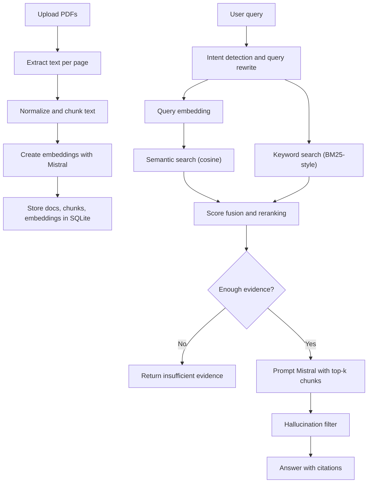

# Simple PDF RAG with FastAPI and Mistral

A small Retrieval-Augmented Generation system for PDF knowledge bases.

It exposes:

- `POST /ingest` to upload one or more PDFs
- `POST /query` to ask grounded questions over the ingested corpus
- `/` for a minimal chat UI

The implementation deliberately avoids external search and RAG frameworks. Retrieval, chunking, fusion, and reranking are implemented directly in Python.

## Stack

- [FastAPI](https://fastapi.tiangolo.com/) for the API
- [Mistral AI API](https://docs.mistral.ai/api/) for embeddings and answer generation
- [PyPDF](https://pypdf.readthedocs.io/en/stable/) for PDF text extraction
- [NumPy](https://numpy.org/) for vector math
- SQLite via Python stdlib for metadata and chunk persistence
- Vanilla HTML/CSS/JS for the UI

## System Design



## Retrieval Pipeline

### 1. Data ingestion

`POST /ingest` accepts one or more PDF files as multipart form uploads.

For each file:

1. Save the PDF to `data/uploads/`
2. Extract text page by page with `pypdf`
3. Normalize whitespace
4. Chunk text with overlap
5. Request embeddings from Mistral
6. Store document metadata, chunks, and embeddings in SQLite

### 2. Chunking considerations

The chunker is intentionally simple and explicit:

- It keeps page numbers so citations can reference source pages.
- It prefers sentence boundaries before splitting hard by size.
- It uses overlap to preserve context across chunk edges.
- It keeps chunk size moderate to balance recall against prompt budget.
- It normalizes whitespace first because PDF extraction often introduces noisy line breaks.

Current defaults:

- Chunk size: `1100` characters
- Overlap: `180` characters

Tradeoffs:

- Larger chunks improve context completeness but can blur ranking precision.
- Smaller chunks improve retrieval granularity but increase index size and embedding cost.
- Character-based limits are simple and deterministic, though token-aware splitting would be more precise in production.

### 3. Query processing

Before retrieval, the backend:

- Detects intent:
  - greetings and casual chat avoid retrieval
  - restricted queries trigger refusal
  - knowledge questions proceed to search
- Rewrites the query:
  - removes weak filler words
  - extracts focus terms
  - appends them to the search query to improve both semantic and keyword recall

### 4. Semantic + keyword search

The system combines two retrieval signals:

- Semantic search:
  - embed the rewritten query with Mistral
  - compute cosine similarity against stored chunk embeddings
- Keyword search:
  - run a handwritten BM25-style scorer over normalized chunk text

Why combine them:

- semantic similarity handles paraphrases and abstract wording
- keyword matching catches exact terms, names, numbers, and acronyms

### 5. Fusion and reranking

Results are merged with weighted score fusion:

- `0.65 * normalized semantic score`
- `0.35 * normalized keyword score`
- small coverage boost for direct query-term overlap

Then results are reranked by:

- fused score
- semantic score
- keyword score
- chunk length as a weak tie-breaker

### 6. Evidence gate and generation

If the top chunk score is below a threshold, the system returns:

`insufficient evidence`

Otherwise it:

1. Builds a prompt with the top retrieved chunks
2. Instructs the LLM to use only provided evidence
3. Requires bracketed citations like `[1]`
4. Runs a lightweight post-hoc evidence check that flags answers containing too many unsupported sentences

## Safety and Security

- The app only answers grounded questions about uploaded PDFs.
- It refuses PII extraction patterns and direct legal or medical advice prompts.
- API keys should be supplied through environment variables, not committed to source.
- The browser UI escapes dynamic content before rendering.
- Uploaded files and embeddings remain local to the app database and filesystem.

## Project Layout

```text
app/
  main.py
  config.py
  schemas.py
  services/
    chunking.py
    mistral_client.py
    pdf_utils.py
    rag_service.py
    retrieval.py
    storage.py
  static/
    app.js
    styles.css
  templates/
    index.html
data/
  uploads/
tests/
```

## Run Locally

### 1. Create an environment

```bash
python3 -m venv .venv
source .venv/bin/activate
pip install -r requirements.txt
```

### 2. Configure Mistral

Set your API key in the environment.

```bash
export MISTRAL_API_KEY="YOUR_KEY"
```

If you are evaluating this against the provided assignment key, set that value here instead of hardcoding it into the repository.

Optional overrides:

```bash
export MISTRAL_CHAT_MODEL="mistral-small-latest"
export MISTRAL_EMBED_MODEL="mistral-embed"
export RAG_TOP_K="8"
export RAG_MIN_EVIDENCE_SCORE="0.18"
```

### 3. Start the app

```bash
uvicorn app.main:app --reload
```

Open [http://127.0.0.1:8000](http://127.0.0.1:8000).

## API

### `POST /ingest`

Multipart form-data with one or more `files`.

Example:

```bash
curl -X POST http://127.0.0.1:8000/ingest \
  -F "files=@/path/to/file1.pdf" \
  -F "files=@/path/to/file2.pdf"
```

### `POST /query`

JSON body:

```json
{
  "query": "What does the report say about customer retention?",
  "top_k": 6
}
```

Example:

```bash
curl -X POST http://127.0.0.1:8000/query \
  -H "Content-Type: application/json" \
  -d '{"query":"Summarize the retention strategy","top_k":6}'
```

## Scalability Notes

This implementation is intentionally simple, but the design can evolve:

- Move ingestion to background workers for large PDFs or batches.
- Cache embeddings and query results.
- Replace SQLite with Postgres for concurrency and operational resilience.
- Add token-aware chunking and table-aware PDF extraction.
- Incrementally rebuild index state rather than scanning all chunks on every query.
- Add evaluation datasets for tuning thresholds and chunk sizes.

## Limitations

- `pypdf` works well for text PDFs, but scanned PDFs need OCR.
- The hallucination filter is heuristic, not a formal verifier.
- Retrieval currently loads chunk rows from SQLite into memory for scoring.
- Query rewriting is rule-based rather than model-based.

## Mistral References

- [Chat completions docs](https://docs.mistral.ai/api/endpoint/chat)
- [Embeddings docs](https://docs.mistral.ai/api/endpoint/embeddings)
