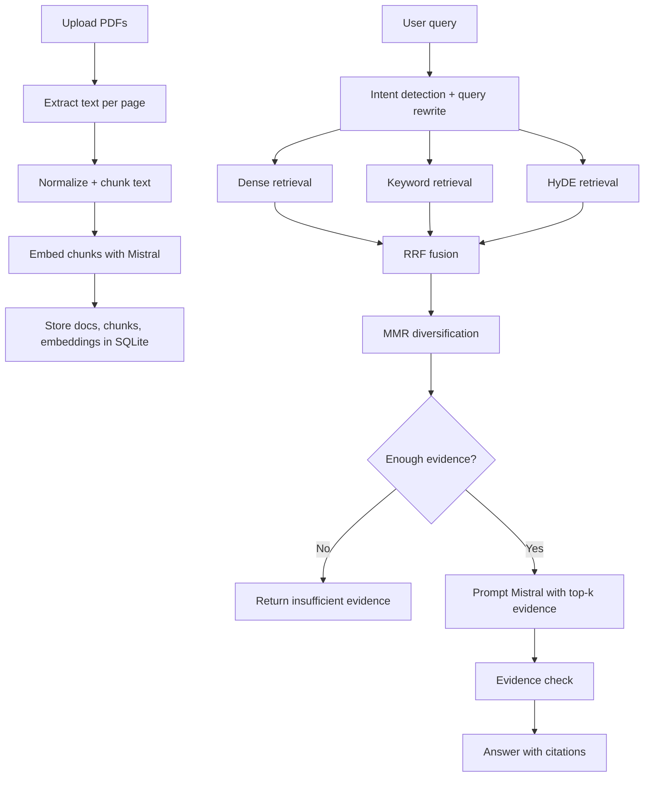

# First-Principles RAG

This project is a PDF question-answering system built with FastAPI and Mistral. I kept the implementation close to the assignment constraints: no external RAG framework, no external search library, and no third-party vector database. The retrieval pipeline, fusion logic, reranking, and evidence checks are implemented directly in Python.

## What it does

- upload one or more PDFs
- extract text and chunk it
- build embeddings with Mistral
- retrieve relevant evidence for a user question
- generate a grounded answer with citations
- refuse or return `insufficient evidence` when support is weak

API endpoints:

- `POST /ingest`
- `POST /query`
- `POST /reset`

There is also a browser UI for upload, querying, history, and citation review.

## Main idea

I did not want this to be just a basic “embed chunks and do cosine similarity” system. The main focus was retrieval quality.

The pipeline combines:

- dense retrieval from the rewritten query
- BM25-style keyword retrieval written directly in Python
- HyDE-style retrieval using a hypothetical answer passage
- Reciprocal Rank Fusion to combine rankers
- MMR to reduce redundant evidence
- section-aware boosts from PDF headings
- sentence-level evidence extraction for cleaner citations

## Architecture



## Techniques used

### 1. Chunking

The chunker is sentence-aware and uses overlap. I kept page numbers on every chunk so the system can cite the source pages later. I also extract a best-effort section title from the page text and attach it to chunks. For research papers, I filter likely references pages because they pollute retrieval.

Why this helps:

- sentence boundaries are better than arbitrary fixed splits
- overlap reduces edge effects
- section metadata helps when the query is about a specific part of a paper
- references pages often retrieve well for the wrong reasons

### 2. Query processing

Before retrieval, the system:

- detects intent so greetings like `hello` do not trigger document search
- rewrites the query into a more retrieval-friendly form
- normalizes a few common technical misspellings such as `embeding -> embedding`

Why this helps:

- avoids unnecessary retrieval
- improves recall for narrow technical questions
- supports both dense and keyword retrieval

### 3. Retrieval

I use three retrieval signals:

1. dense retrieval from the rewritten query embedding
2. sparse keyword retrieval with a BM25-style scorer
3. HyDE-style dense retrieval using a generated hypothetical answer passage

Why this helps:

- dense retrieval is good at paraphrases
- keyword retrieval is good for exact terms, formulas, acronyms, and headings
- HyDE helps when the user’s wording differs from the source text

Related paper:

- Gao et al., ACL 2023, HyDE: [paper](https://aclanthology.org/2023.acl-long.99/)

### 4. Fusion and reranking

I combine the different rankings with Reciprocal Rank Fusion (RRF). After that, I apply additional exact-term, phrase, heading, and section-title boosts. Finally, I use Maximal Marginal Relevance (MMR) so the final evidence set is not full of near-duplicate chunks.

Why this helps:

- RRF is usually more stable than hand-picking a single ranker
- exact-term and heading boosts help for technical PDF QA
- MMR makes the evidence set more diverse and useful

Related papers:

- Cormack, Clarke, Büttcher, SIGIR 2009, RRF: [metadata](https://ir.webis.de/anthology/2009.sigirconf_conference-2009.146/)
- Carbonell and Goldstein, SIGIR 1998, MMR: [metadata](https://sigmod.org/publications/dblp/db/conf/sigir/CarbonellG98.html)

### 5. Evidence extraction

Retrieval still happens at chunk level, but the citation text shown to the user is reduced to the most query-relevant sentence or sentences from each selected chunk.

Why this helps:

- chunk retrieval is more stable than indexing only sentences
- sentence-level evidence is easier to inspect than dumping whole chunk text

### 6. Generation and grounding

The answer prompt tells the model to stay inside the retrieved evidence. If the evidence is weak, the system returns `insufficient evidence`. After generation, I run a lightweight evidence check that looks for unsupported answer sentences.

This is not a formal verifier, but it does reduce some obvious unsupported answers.

## Libraries used

- [FastAPI](https://fastapi.tiangolo.com/)
- [Mistral AI API](https://docs.mistral.ai/api/)
- [PyPDF](https://pypdf.readthedocs.io/en/stable/)
- [NumPy](https://numpy.org/)
- SQLite from the Python standard library

## Run locally

```bash
python3 -m venv .venv
source .venv/bin/activate
pip install -r requirements.txt
export MISTRAL_API_KEY="YOUR_KEY"
uvicorn app.main:app --reload
```

Open [http://127.0.0.1:8000](http://127.0.0.1:8000).

During development, the provided assignment key returned `401 Unauthorized`, so I used a personal Mistral key instead. The application works with any valid key through `MISTRAL_API_KEY`.

Useful overrides:

```bash
export RAG_HYDE_ENABLED=true
export RAG_TOP_K=8
export RAG_MIN_EVIDENCE_SCORE=0.18
export RAG_EMBED_BATCH_SIZE=2
```

## API

### `POST /ingest`

Upload one or more PDFs:

```bash
curl -X POST http://127.0.0.1:8000/ingest \
  -F "files=@/path/to/file1.pdf" \
  -F "files=@/path/to/file2.pdf"
```

### `POST /query`

Ask a question:

```bash
curl -X POST http://127.0.0.1:8000/query \
  -H "Content-Type: application/json" \
  -d '{"query":"How does self-attention differ from recurrent models?","top_k":6}'
```

### `POST /reset`

Clear the local index:

```bash
curl -X POST http://127.0.0.1:8000/reset
```

## Evaluation examples

These are the main questions I used to check retrieval quality and grounded generation.

| PDF(s) | Question | Expected answer summary |
| --- | --- | --- |
| `attention.pdf` | How does self-attention differ from recurrent models in the Transformer paper? | self-attention is parallelizable, shortens dependency paths, and replaces step-by-step recurrence with attention over all positions |
| `attention.pdf` | What embeddings does the Transformer use, and how are positional encodings handled? | learned token embeddings of dimension `d_model`, positional information added separately, sinusoidal positional encodings in the main model, learned positional embeddings reported as similar |
| `bert.pdf` | What is BERT’s pre-training objective? | masked language modeling plus next sentence prediction |
| `bert.pdf` | Why is bidirectional pre-training important in BERT? | it lets the model use both left and right context, which improves contextual understanding and downstream task performance |
| `bert.pdf` + `attention.pdf` | Compare the main contribution of BERT with the main contribution of Attention Is All You Need. | Transformer introduces the self-attention architecture; BERT uses the Transformer encoder with bidirectional pre-training for transfer learning |
| any indexed set | unsupported or out-of-scope question | the system should return `insufficient evidence` or refuse when support is weak or the request is restricted |

## Security and failure handling

- API keys are read from environment variables only
- uploaded files stay local to the application workspace
- the UI escapes model output before rendering
- PII, legal-advice, and medical-advice requests are refused
- weak evidence returns `insufficient evidence`
- Mistral `400`, `401`, and `429` errors are surfaced clearly for debugging

## Limitations

- `pypdf` works well for text PDFs, but not scanned-image PDFs
- the hallucination filter is heuristic, not a verifier
- retrieval keeps the indexed corpus in process memory for faster queries, which is fine for a take-home project but not ideal for very large collections
- HyDE improves recall but adds one extra LLM call for knowledge queries
- section-title extraction is heuristic and depends on PDF text layout quality

## Project layout

```text
app/
  main.py
  config.py
  schemas.py
  services/
    chunking.py
    mistral_client.py
    pdf_utils.py
    rag_service.py
    retrieval.py
    storage.py
  static/
    app.js
    styles.css
  templates/
    index.html
data/
  uploads/
tests/
```
